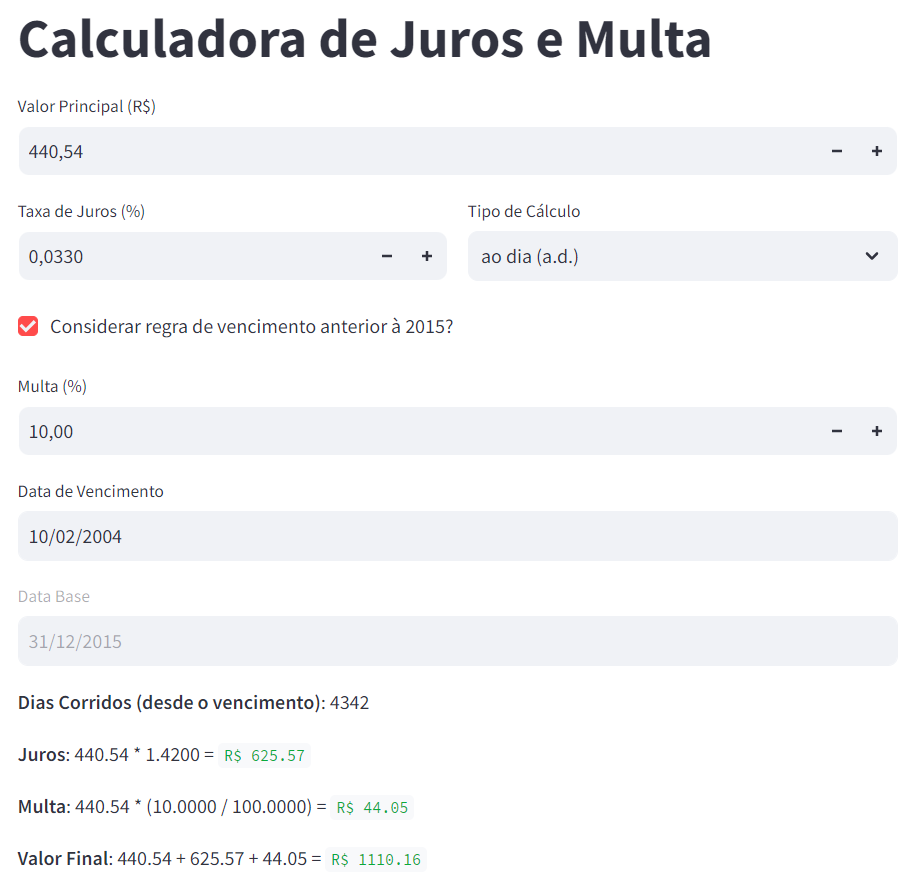

# Calculadora de Juros e Multa

Este é um aplicativo Streamlit que calcula o valor final com base em um valor principal, taxa de juros, tipo de cálculo (mensal ou diário), multa e número de dias decorridos.



Confira a [demonstração](https://calculadora-juros-multa-boleto.streamlit.app/).

## Recursos

- Campos de entrada para valor principal, taxa de juros, tipo de cálculo, multa e dias decorridos
- Cálculo automático de juros, multa e resultado final
- Atualizações em tempo real dos resultados à medida que o usuário altera os valores de entrada

## Instalação

1. Instale o Streamlit se você ainda não o fez:
   ```bash
   pip install streamlit
   ```

2. Clone o repositório ou baixe o arquivo app.py.

3. Navegue até o diretório onde app.py está salvo e execute o aplicativo:

```bash
streamlit run app.py
```

4. Seu navegador da web padrão deve abrir com o aplicativo Streamlit em execução.

### Uso
1. Digite o valor principal, taxa de juros, tipo de cálculo, multa e dias decorridos.
2. O aplicativo calculará e exibirá automaticamente os juros, a multa e o resultado final.
3. À medida que você altera os valores de entrada, os resultados serão atualizados dinamicamente.

### Contribuindo
Se você encontrar algum problema ou tiver sugestões de melhorias, sinta-se à vontade para abrir uma issue ou enviar um pull request.

### Licença
Este projeto está licenciado sob a Licença MIT.
